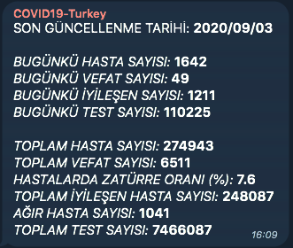

# COVID-19 Turkey Telegram Bot

Sends daily and total COVID-19 statistics in Turkey.

- Gets data from [ykursadkaya/covid19-turkey-api](https://github.com/ykursadkaya/covid19-turkey-api)
- Checks the API every n (default is 60 in script) seconds, if anything changes in the stats sends message in Turkish via Telegram Bot API with provided API token and chat ID.


**Telegram Message Screenshot**




## Setup

### Create your Telegram Bot

1. Create your bot and get your API token

   [Bots: An introduction for developers](https://core.telegram.org/bots#3-how-do-i-create-a-bot)

2. Add your bot to a group or start a private chat with your bot

3. Get chat_id from Telegram Bot API

   [Getting updates](https://core.telegram.org/bots/api#getting-updates)

   

### Run on a Docker container

1. Clone this repository

   ```bash
   git clone https://github.com/ykursadkaya/covid19-turkey-bot.git
   cd covid19-turkey-bot
   ```

2. Build Docker image

   ```bash
   docker build -t covidbot .
   ```

3. Run container

   ```bash
   docker run -p <external-port>:5000 --name <container-name> -e TELEGRAM_API_TOKEN=<api-token> -e TELEGRAM_CHAT_ID=<chat-id> -e COVIDAPI_URL=<api-url> covidbot
   ```


### Run directly on your machine

1. Install Python 3

   [Python Download Page](https://www.python.org/downloads/)

2. Install pip for Python 3

   [pip installation guide](https://pip.pypa.io/en/stable/installing/)

3. Clone this repository

   ```bash
   git clone https://github.com/ykursadkaya/covid19-turkey-bot.git
   cd covid19-turkey-bot
   ```

4. Install required Python packages

   ```bash
   pip3 install -r requirements.txt
   ```

5. Run [script](./covidbot.py)

   ```bash
   python3 main.py
   ```


